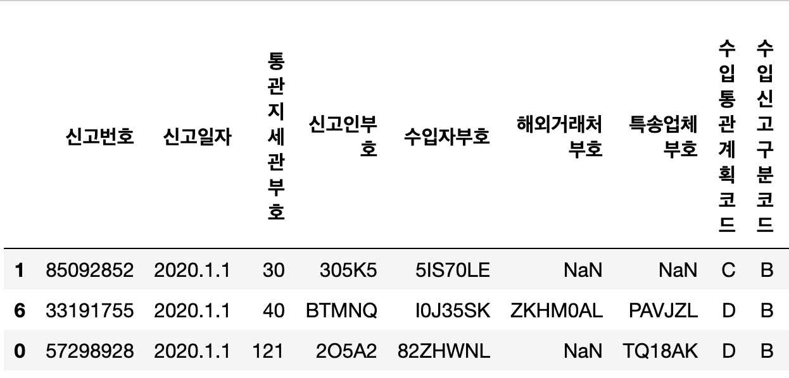
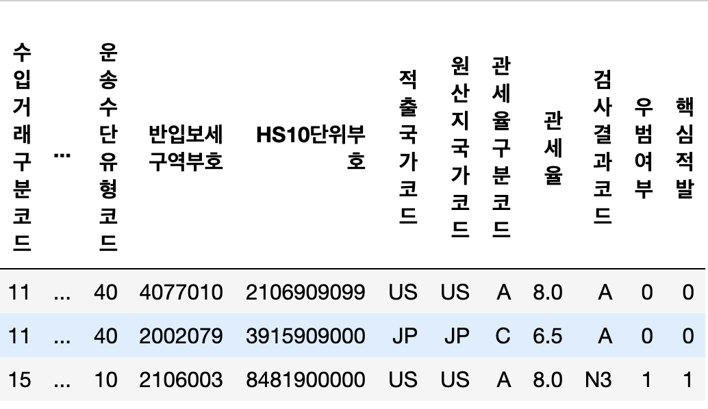

# Data science class  in CNU

## Mini Project  

## 2021년 관세청 - 충남대학교 수입화물 우범도 AI 경진대회(21.5.3 ~ 21.5.23 )

1. 주제

 AI를 활용하여 우리나라로 수입되는 화물의 우범도를 예측하는 모델 개발

2.  배경 및 목적

 관세청은 우리나라로 들어오거나 나가는 모든 물품을 신속하게 통관하는 한편, 관련법규를 엄정하게 집행함으로써 튼튼한 경제, 안전한 사회를 위해 관세국경을 수호하는 기관입니다.
매년 약 1천백만건, 매달 약 1백만건(란별기준)이 수입신고되는 상황에서 수입 화물을 검사할 수 있는 인력은 한정되어 있다 보니, 관세국경단계에 서 사회안전, 국민건강 등을 위협하는 고위험물품을 선별(타겟팅)하여 선제 적으로 차단하는 기능이 중요한 업무중 하나입니다.
검사기준 수립에 다양한 선별 기법이 활용되고 있는 가운데, 요즘 가장 핫한 AI를 활용하여 수입화물의 우범도를 예측하는 모델을 개발.

본 경진대회는 수입신고 기본항목 22개를 활용하여 해당 수입화물의 우범도 를 예측하는 것이 과제입니다.

3. 데이터 셋

- 1월 ~ 12월까지의  수입 화물 데이터 1~9월까지는 train data 10~12월은 test데이터를 사용 train : 76837개 test : 23163
-  총 24개의 feature로 구성 21개는 독립변수 3개는 종속변수(검사결과코드 , 우범, 핵심적발)

- Raw Data sample

4. 결과

Baseline model

f1-score : 0.42

Our model
||precision|recall|f1-score|
|------|---|---|-------|
|정상|0.92|0.72|0.81|
|우범|0.46|0.79|0.58|

5. 전처리 및 변환

- 주요 변수의 전처리 및 변환은 다음과 같다.

- 크게 범주형과 수치형 변수로 나누어서 전처리

  5.1 범주형 변수

- 전처리를 진행 한후 최종적으로 categorical data로 변환 후 one-hot encoding 적용
- 아래는 각 주요 세부 항목 전처리

- 신고일자 : test data에는 10-12월 data만 있으므로 전처리시 train data에 없는 값을 고려해야한다. 따라서 년 원 일 중 '일'과 '요일'만 전처리를 진행 한다.

- HS10단위 부호 : 구체적인 품목명을 의미하는 것. 국제 공통은 6단위이나 한국은 10단위 사용. 2단위는 전체 품목을 의미하는것
-> 10단위 중 앞 2자리를 추출해서 HS2단위로 feature creation.

  5.2 수치형 변수

- 관세율, 과세가격금액, 관세율 모두 histogram을 그리면 right skew형 데이터이다.

- log transform을 통해 정규분포 모양으로 근사화시키고 최종적으로 z - transform을 해서 스케일링을 맞춰춘다.
